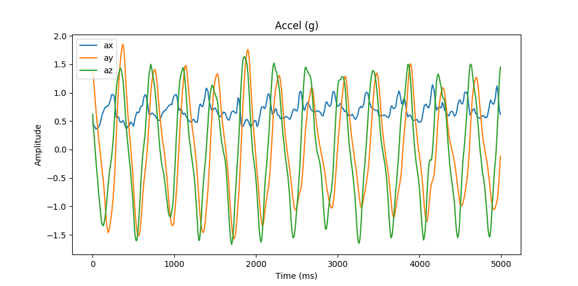

# Acquisition des données avec l'IMU
Ce document présente les différentes cellules du script utilisé pour tester le module. Le code source est directement accessible à partir du fichier *IMU_DACQ.ipynb*. Il est possible de l'importer dans le notebook. L'IMU était cadencé à 100Hz.
```python
# Création et paramétrage du port série
import serial
ser = serial.Serial()
ser.baudrate = 115200 
ser.port = 'COM3' # Ou '/dev/tty.usbmodem1411' par exemple, sous MacOS
ser
```

La sortie donne les paramètres de configuration du port :


    Serial<id=0xa3b5470, open=False>(port='COM3', baudrate=115200, bytesize=8, parity='N', stopbits=1, timeout=None, xonxoff=False, rtscts=False, dsrdtr=False)


```python
# Ouverture connection au port série
ser.open()
ser.is_open
```

Tout va bien, le port série est ouvert :-) :


    True

500 échantillons des neuf canaux à 100Hz, c.a.d. cinq secondes de données : 

```python
# Lecture et accumulation de 500 frames de données (temps, ax, ay, az, gx, gy, gz, mx, my, mz)
lines = []
for i in range(0,500):
    line = ser.readline()
    line = line.rstrip()
    lines.append(line)
print('Première ligne : ' + lines[0].decode('UTF8'))
# Fermeture connection port série dans la foulée
ser.flush()
ser.close()
ser.is_open
```
Chaque ligne de données à la forme suivante :

    b'55932, 0.88, -0.05, -0.52, -1.95, 1.28, -3.17, 57.16, -64.07, -52.36'
    
C'est une suite d'octets, même si cela ressemble à une chaine de caractères : le charactère b en tête spécifie que c'est une série d'octets.

Le port série est maintenant fermé, normal :


    False


Analyse des données accumulées :

```python
# Décodage des 500 frames
time0 = lines[0].decode('UTF8').split(',')[0]
times = []; axs = []; ays = []; azs = []; gxs = []; gys = []; gzs = []; mxs = []; mys = []; mzs = [];
for row in lines:
    time, ax, ay, az, gx, gy, gz, mx, my, mz = row.decode('UTF-8').split(',')
    times.append(int(time) - int(time0));
    axs.append(float(ax)); ays.append(float(ay)); azs.append(float(az));
    gxs.append(float(gx)); gys.append(float(gy)); gzs.append(float(gz));
    mxs.append(float(mx)); mys.append(float(my)); mzs.append(float(mz));
```
On remarque l'utilisation de la méthode *decode('UTF8')* pour transformer le flux d'octets en chaine de caractères.
Affichage dans trois graphes (accel, gyro, magneto) :

```python
# Pour inclure les graphiques dans le notebook
%matplotlib inline
# Affichage des accélérations
import matplotlib.pyplot as plt
plt.figure(1)
plt.title('Accel (g)')
plt.xlabel('Time (ms)')
plt.ylabel('Amplitude')
plt.plot(times, axs, label = 'ax')
plt.plot(times, ays, label = 'ay')
plt.plot(times, azs, label = 'az')
plt.legend()
plt.show()
```





```python
# Affichage des gyros
plt.figure(2)
plt.title('Gyro (°/s)')
plt.xlabel('Time')
plt.ylabel('Amplitude')
plt.plot(times, gxs, label = 'gx')
plt.plot(times, gys, label = 'gy')
plt.plot(times, gzs, label = 'gz')
plt.legend()
plt.show()
```


```python
# Affichage des magnétos
plt.figure(3)
plt.title('Mag (uT)')
plt.xlabel('Time')
plt.ylabel('Amplitude')
plt.plot(times, mxs, label = 'mx')
plt.plot(times, mys, label = 'my')
plt.plot(times, mzs, label = 'mz')
plt.legend()
plt.show()
```


Écriture des données dans un fichier texte avec des virgules comme séparateur :

```python
# Écriture dans un fichier texte csv
file = open("data.txt", "w")
file.write("time (ms), xAccel (g), yAccel (g), zAccel (g), xGyro (°/s), yGyro(°/s), zGyro(°/s), xMagneto (uT), yMagneto(uT), zMagneto(uT)" + "\n")
for row in lines:
    file.write(row.decode('UTF-8') + "\n")
file.close()
```

Le fichier *data.txt* devrait ressembler à ça :

    time (ms), xAccel (g), yAccel (g), zAccel (g), xGyro (°/s), yGyro(°/s), zGyro(°/s), xMagneto (uT), yMagneto(uT), zMagneto(uT)
    189171, 0.02, 0.01, 0.98, -0.24, 0.61, 0.06, 65.42, -11.40, 3.45
    189181, 0.02, 0.01, 0.99, -0.30, 0.73, 0.00, 65.57, -11.70, 3.60
    189191, 0.02, 0.01, 0.99, -0.18, 0.67, 0.06, 64.67, -11.40, 3.15
    189201, 0.02, 0.01, 1.00, -0.24, 0.73, 0.12, 66.92, -11.40, 4.50
    189211, 0.02, 0.02, 0.99, -0.24, 0.67, 0.06, 64.97, -10.35, 3.45
    189221, 0.02, 0.01, 0.98, -0.18, 0.73, 0.06, 66.17, -10.35, 2.70
    ...
    
On peut ouvrir ce fichier sous Matlab  ou  [Octave](https://www.gnu.org/software/octave/) en utilisant la commande suivante :

    values = dlmread('data.txt', ',', 1, 0);
